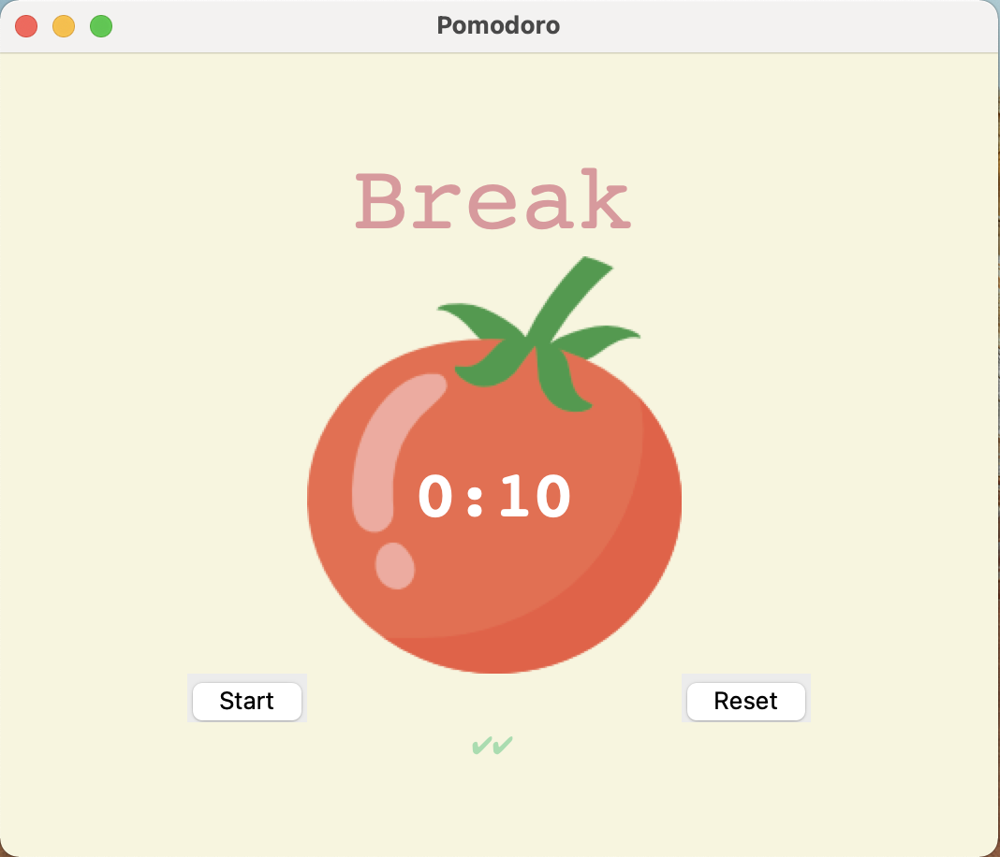
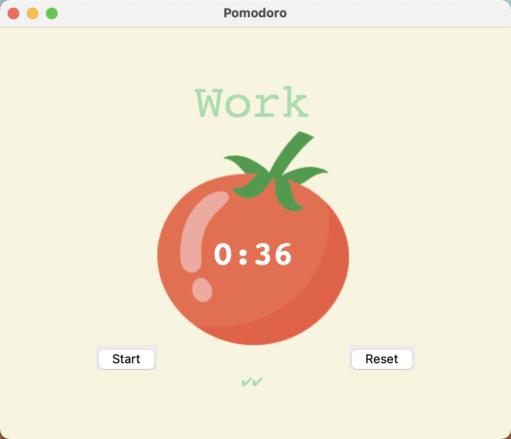

# pomodoro-timer

This Pomodoro timer is part of the 100 Days of Code - The Complete Python Pro Bootcamp.

The Pomodoro Technique is a time management method developed by Francesco Cirillo in the late 1980s. It uses a kitchen timer to break work into intervals, typically 25 minutes in length, separated by short breaks. Each interval is known as a pomodoro, from the Italian word for tomato, after the tomato-shaped kitchen timer Cirillo used as a university student. 

This technique is an effective way of boosting working efficiency.

This toy project is a timer for 1-minute-work (for demo purposes only) followed by a 5-minute-short-break. After 4 iterations of work-break cycle, there is a huge 20 minutes break to reward your hard work. 

## GUI Demo

  
  

## Instructions
The timer starts automatically. After each cycle, a small green check mark appears on the bottom of the screen. 
- To restart the current timer, click on "start". 
- To restart the whole timer, click on "reset".
